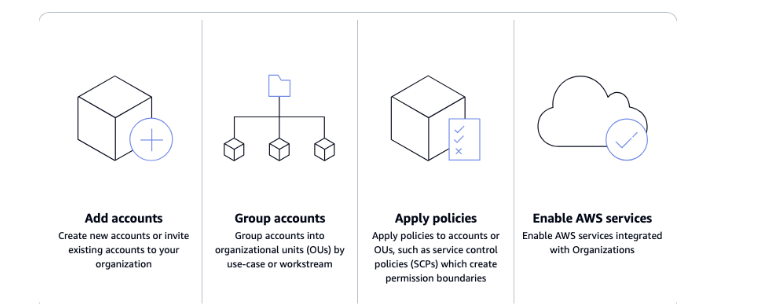
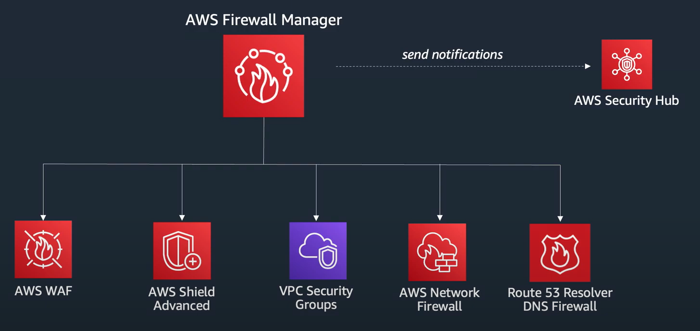
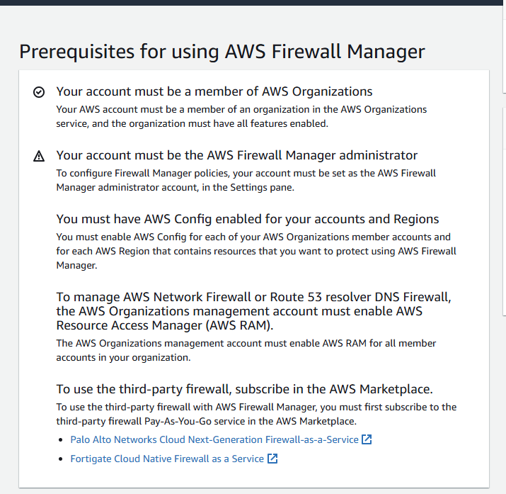

# AWS organizations
is the place in which we can centrally manage your enviroment. the following is a high-level explanation on how to user AWS organizations

# AWS WAF & Organizations

Using Firewall Manager, you can roll out AWS WAF rules, create AWS Shield Advanced protections, configure and audit Amazon Virtual Private Cloud (Amazon VPC) security groups, and deploy AWS Network Firewalls. Use Firewall Manager to set up your protections just once and have them automatically applied across all accounts and resources within your organization, even as new resources and accounts are added.

## AWF Firewall manager

is a security management service user to centrally configure and manage your AWS firewall policies across accounts and applications in your organization managed by AWS organization

to Start with AWS firewall manager we need: 
- onboard with AWS Organizations
- Enable AWS config (all accounts)
- Enable AWS resources access manager (for AWS network firewall and DNS firewall only)

once AWS firewall manager is configured we can set up the following 

- Helps to protect all resources with specific tags
- Automatically adds protection to resources that are added to your account
- Allows you to subscribe all member accounts in an AWS Organizations organization to AWS Shield Advanced, and automatically subscribes new in-scope accounts that join the organization
- Allows you to apply security group rules to all member accounts or specific subsets of accounts in an AWS Organizations organization, and automatically applies the rules to new in-scope accounts that join the organization
- Lets you use your own rules, or purchase managed rules from AWS Marketplace

### Deploy WAF rules across multiple accounts 

The easiest way to set up WAF is with *AWS Firewall manager* because this service does provide **centralized management**.  Firewall Manager lets you define WAF rules and policies centrally in a **management account**.
it is **not necessary** to use *AWS Firewall manager* to set up WAF rules across multiple sub-accounts, but requiere to set up every single account *manually* and update the rules the same way 

If we we use AWS Firewall manager:
- Policies can be automatically applied across all or selected member accounts in your AWS Organization.
- It monitors compliance by ensuring that all accounts adhere to the defined policies.
- Changes to WAF rules are propagated automatically, making it easier to manage at scale.

## possible cost of this set up 
Setting up AWS Firewall Manager with AWS WAF and integrating it with the **AWS Marketplace Top OWASP Managed Rules** involves costs for several services. Here's a detailed cost breakdown tailored to your case with **6 accounts** and **OWASP Top 10 WAF Rules**.

---

### **1. AWS Firewall Manager Costs**

AWS Firewall Manager charges based on the number of policies active in your organization:

#### **Firewall Manager Pricing**:

- **$100 per policy per region per month**.

#### **Assumptions for Your Case**:

- You want **1 WAF policy** to govern the Top OWASP Rules across 6 accounts.
- You need this policy in **3 regions** (e.g., `us-east-1`, `us-west-2`, `eu-central-1`).

**Monthly Cost for Firewall Manager**:

1 policy×3 regions×100=$3001 \text{ policy} \times 3 \text{ regions} \times 100 = \$3001 policy×3 regions×100=$300

---

### **2. AWS WAF Costs**

AWS WAF pricing depends on:

- **Web ACLs**: $5 per Web ACL per month.
- **Rules**: $1 per rule per month.
- **Request Processing**: $0.60 per 1M requests.

#### **Using Top OWASP Rules**:

The OWASP Managed Rules from the AWS Marketplace typically include **10-15 rules** for common vulnerabilities (e.g., XSS, SQL Injection).

#### **Assumptions for Your Case**:

- **1 Web ACL** is created in each region: $5 x 3 regions = $15/month.
- **15 rules** applied in each region: $1 x 15 x 3 = $45/month.
- Estimated **1M requests per month** per region: $0.60 x 3 = $1.80/month.

**Monthly Cost for AWS WAF**:

$15+$45+$1.80=$61.80\$15 + \$45 + \$1.80 = \$61.80$15+$45+$1.80=$61.80

---

### **3. Managed Rules from AWS Marketplace**

Marketplace-managed rule groups have their own pricing (varies by vendor). The AWS-provided **AWS WAF Bot Control** or **OWASP Top 10 Rule Groups** usually cost:

- **$20-$30 per rule group per month** per region.

#### **Assumptions for Your Case**:

- Use **1 managed rule group** (OWASP Top 10) in 3 regions: $20 x 3 = $60/month.

---

### **4. AWS Config Costs**

AWS Config is required for Firewall Manager to function. It tracks configuration changes and compliance.

#### **Pricing**:

- **$0.003 per resource recorded per month**.
- **$0.001 per configuration rule evaluation**.

#### **Assumptions for Your Case**:

- Assume **50 resources per account** (e.g., EC2, S3, Lambda) across **6 accounts**: $0.003 x 50 x 6 = $0.90/month.
- Add a minimal number of rule evaluations: negligible for small environments.

**Monthly Cost for AWS Config**:

≈$0.90\approx \$0.90≈$0.90

---

### **5. Total Estimated Monthly Costs**

Here’s the total breakdown:

|**Service**|**Cost**|
|---|---|
|Firewall Manager (1 policy)|$300.00|
|AWS WAF (Web ACL + rules)|$61.80|
|Marketplace Managed Rules|$60.00|
|AWS Config|$0.90|
|**Total**|**$422.70**|

---

### **Annual Cost Estimate**

$422.70×12=$5,072.40 per year\$422.70 \times 12 = \$5,072.40 \, \text{per year}$422.70×12=**$5,072.40per year**

 

#### **Setup Process**:

1. **Enable AWS Organizations**:
    - Ensure that your AWS accounts are part of an organization, with all features enabled.
2. **Designate an Administrator Account**:
    - In AWS Organizations, set up a designated "Firewall Manager Administrator Account."
    - You can use an existing account or create a new one for this purpose.
3. **Configure AWS WAF Rules**:
    - Create and manage your WAF rules in the administrator account.
    - Use Firewall Manager to propagate these rules to all or specific accounts.
4. **Enable AWS Config**:
    - Ensure AWS Config is enabled in all accounts and regions where you want to manage WAF.

## Why does AWS firewall manager needs cloudfront

AWS Firewall Manager uses **CloudFront** to deploy **AWS WAF** rules across multiple accounts because **CloudFront distributions** are globally distributed content delivery networks (CDNs) that integrate seamlessly with AWS WAF, offering several advantages for centralized and scalable deployment of security rules.

CloudFront operates at the edge of AWS's global network, which means:

- *WAF rules applied to CloudFront are enforced at AWS's edge locations*.
- This ensures that malicious traffic is blocked close to the source, reducing latency and preventing unauthorized access from even reaching your backend resources.

CloudFront acts as a **central point where WAF rules can be applied once and automatically propagate to resources** that use CloudFront across multiple accounts. This simplifies the process of enforcing security policies.

Firewall Manager needs a mechanism to enforce WAF policies across resources in different accounts. Since CloudFront is a global service:

- WAF rules deployed to CloudFront apply consistently across all associated accounts and regions.
- It avoids the complexities of region-specific deployment for services like Application Load Balancers (ALBs) or API Gateway.

Firewall Manager operates within an **AWS Organizations** setup. CloudFront provides a common layer where all sub-accounts' WAF policies can be applied in a unified manner, ensuring consistency.

- **Performance**: CloudFront caches content at edge locations, and blocking traffic at this layer prevents unnecessary backend processing.
- **Scalability**: As new accounts and resources are added, Firewall Manager can automatically apply WAF rules to their CloudFront distributions without requiring additional configuration for each account.

# DNS firewall

## How DNS Firewall Can Be Used Across Accounts

# AWS Guard Duty 
Amazon GuardDuty is a threat detection service that continuously *monitors, analyzes, and processes AWS data sources and logs in your AWS environment*. GuardDuty uses threat intelligence feeds, such as lists of malicious IP addresses and domains, file hashes, and machine learning (ML) models to identify suspicious and potentially malicious activity in your AWS environment. The following list provides an overview of potential threat scenarios that GuardDuty can help you detect:

- Compromised and exfiltrated AWS credentials.
    
- Data exfiltration and destruction that can lead to a ransomware event. Unusual patterns of login events in the supported engine versions of Amazon Aurora and Amazon RDS databases, that indicate anomalous behavior.
    
- Unauthorized cryptomining activity in your Amazon Elastic Compute Cloud (Amazon EC2) instances and container workloads.
    
- Presence of malware in your Amazon EC2 instances and container workloads, and newly uploaded files in your Amazon Simple Storage Service (Amazon S3) buckets.
    
- Operating system-level, networking, and file events that indicate unauthorized behavior on your Amazon Elastic Kubernetes Service (Amazon EKS) clusters, Amazon Elastic Container Service (Amazon ECS) - AWS Fargate tasks, and Amazon EC2 instances and container workloads.
